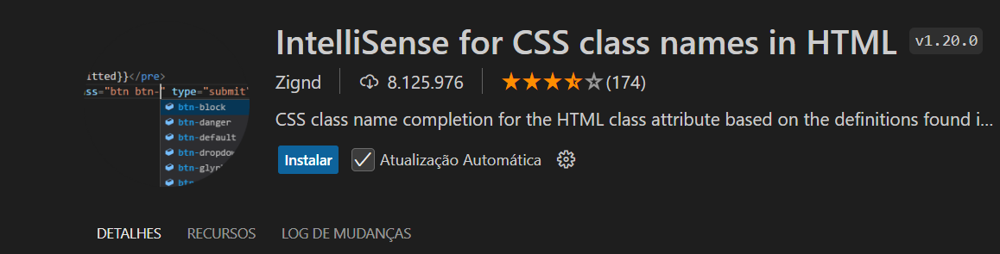
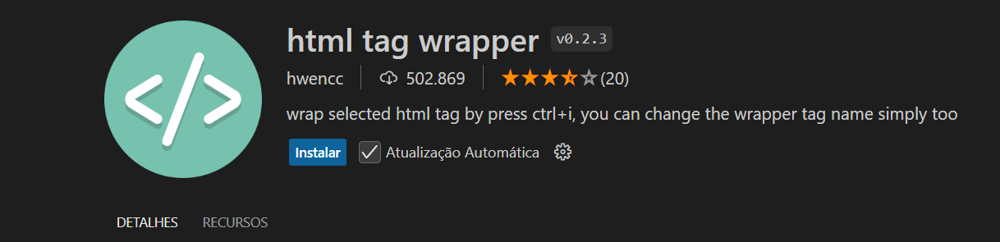

Uma extensão do Visual Studio Code que fornece preenchimento automático de nome de classe CSS para o classatributo HTML com base nas definições encontradas no seu espaço de trabalho ou em arquivos externos referenciados por meio do linkelemento.

A extensão HTML Tag Wrapper do VS Code fornece informações de documentação e sugestões de código ao digitar tags HTML. Ao digitar uma tag, a extensão exibe uma explicação ou breve descrição sobre o propósito da tag. 
