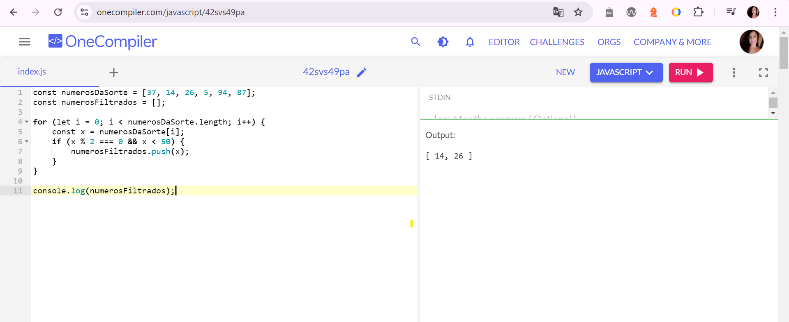
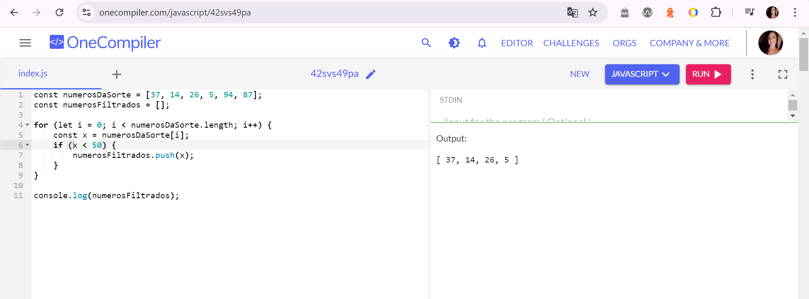

## For avaliar elemento do array

Acesse o site OneCompiler (https://onecompiler.com/javascript/), copie e cole o array 'numerosDaSorte', e logo em seguida escreva o código necessário para avaliar cada elemento do array e imprimir uma frase seguindo algum dos seguintes três modelos:

- X é par e menor que 50
- X é menor que 50
- X é maior que 50

numerosDaSorte = [37, 14, 26, 5, 94, 87]  

X é par e menor que 50

********************************************************
 X é menor que 50

********************************************************
X é maior que 50

