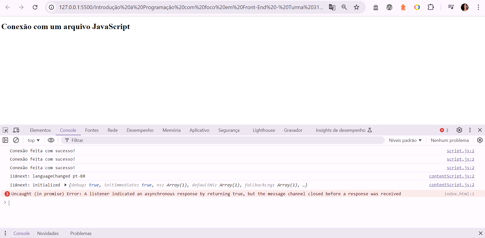

## Conectando o HTML com o JavaScript

### Instruções do projeto

Crie um novo projeto com dois arquivos: index.html e script.js. No arquivo HTML, defina a estrutura padrão HTML, e inclua uma tag h1 com o título "Conexão com um arquivo JavaScript". No arquivo JavaScript defina uma função que imprima a mensagem "Conexão feita com sucesso!" no terminal, e execute ela três vezes. Finalmente, conecte ambos arquivos, abra seu projeto no navegador usando a extensão LiveServer e confira se a mensagem foi impressa três vezes no terminal. 

###Código HTML

<!DOCTYPE html>
<html lang="en">
<head>
    <meta charset="UTF-8">
    <meta name="viewport" content="width=device-width, initial-scale=1.0">
    <title>Document</title>
    
</head>
<body>
    <h1>Conexão com um arquivo JavaScript</h1>
</body>
</html>

[Clique para acessar o arquivo HTML](index.html)

### Código JavaScript

function imprimirmensagem (){
    console.log("Conexão feita com sucesso!");
}

imprimirmensagem();
imprimirmensagem();
imprimirmensagem();

[Clique para acessar o arquivo JavaScript](script.js)

### Resultado

