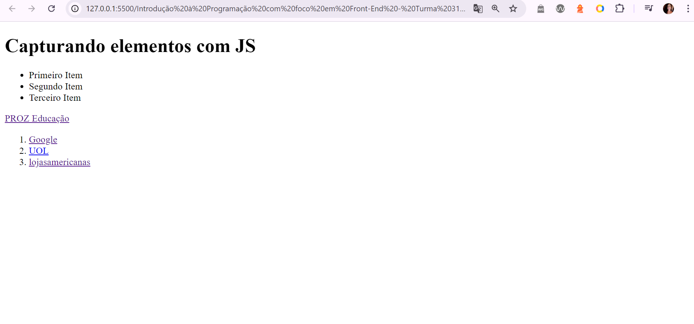

## Capturando elementos com JS

### Instruções do projeto

Crie um projeto com dois arquivos: index.html e script.js. No arquivo 'index' insira a estrutura base HTML e dentro da tag 'body' inclua quatro tags vazias: h1, ul, a, ol. Adicione o atributo id="titulo" à tag h1, o atributo href="https://prozeducacao.com.br" à tag 'a', e o atributo id="lista-ordenada" à tag 'ol'. Na sequência, realize a conexão entre o arquivo HTML e o arquivo JavaScript.

No arquivo script.js capture os quatro elementos criados, e use a propriedade .innerText para adicionar conteúdo textual aos elementos 'h1' e 'a', e a propriedade .innerHTML para adicionar três itens simples na lista não ordenada, e três itens com links para outros sites na lista ordenada.

<!-- Código HTML-->

### Código HTML

```html
<!DOCTYPE html>
<html lang="pt-br">
    <head>
        <meta charset="UTF-8" />
        <meta name="viewport" content="width=device-width, initial-scale=1.0" />
        <title>Capturando elementos com JS</title>
        <script src="script.js" defer></script>
    </head>
    <body>
        <h1 id="titulo"></h1>
        <ul></ul>
        <a id="link" href="https://prozeducacao.com.br"></a>
        <ol id="lista-ordenada"></ol>
    </body>
</html>
```

[Clique para acessar o arquivo HTML](index.html)

<!-- Código JavaScript -->

### Código JavaScript

```javascript
let titulo = document.getElementById("titulo");
let listaUl = document.querySelector("ul");
let link = document.getElementById("link");
let listaOl = document.getElementById("lista-ordenada");

titulo.innerText = "Capturando elementos com JS";
link.innerText = "PROZ Educação";

listaUl.innerHTML = `
    <li>Primeiro Item</li>
    <li>Segundo Item</li>
    <li>Terceiro Item</li>
`;

listaOl.innerHTML =
    '<li><a href="https://www.google.com.br/?hl=pt-BR" target="_blank">Google</a></li>' +
    '<li><a href="https://www.uol.com.br/" target="_blank">UOL</a></li>' +
    '<li><a href="https://www.americanas.com.br/" target="_blank">lojasamericanas</a></li>';
```

[Clique para acessar o arquivo JavaScript](script.js)

### Resultado

<!-- Imagem -->


