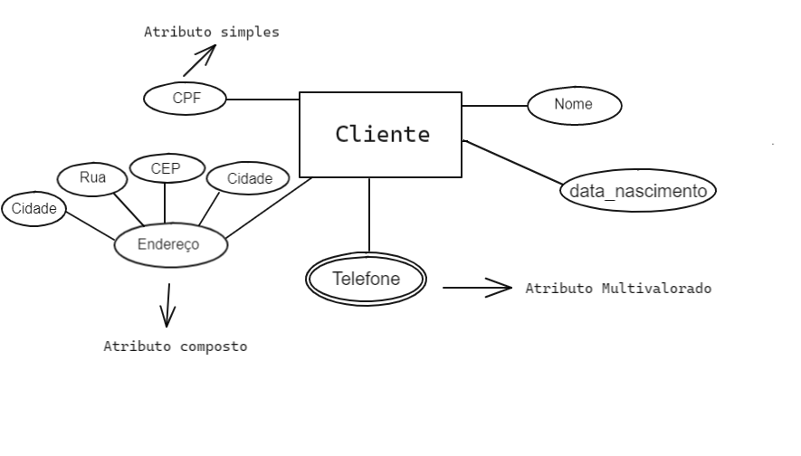

## Atributos de um banco de dados

### Instruções do projeto

O desenvolvimento de um projeto de banco de dados passa por fases importantes para a sua implementação, como a de projeto conceitual. Diante disso, crie uma entidade que tenha atributos simples, composto e multivalorado.

### Entidade: Cliente

#### Atributos Simples:

1. CPF do cliente: Identificador único para cada cliente.
2. Nome: Nome do cliente.
3. Data Nascimento: Data nascimento do cliente

#### Atributos Compostos:

1. Detalhes de Cadastro do Cliente:
    - Endereço do cliente: Detalhes do endereço Av, rua, cidade, Bairro, Cep,  
    
#### Atributo Multivalorado:

1. Telefone do cliente : Um cliente pode possui varios números de telefone.

