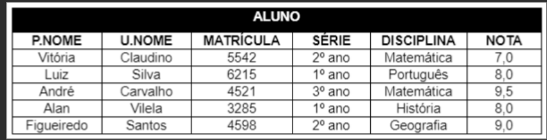
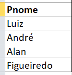
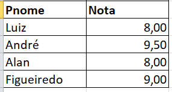
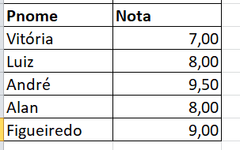
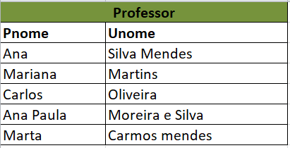
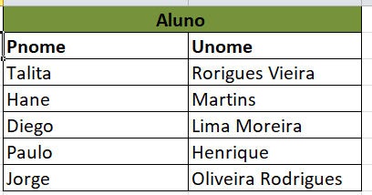
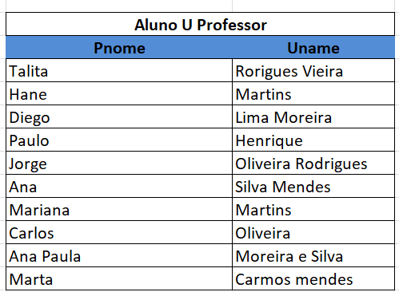
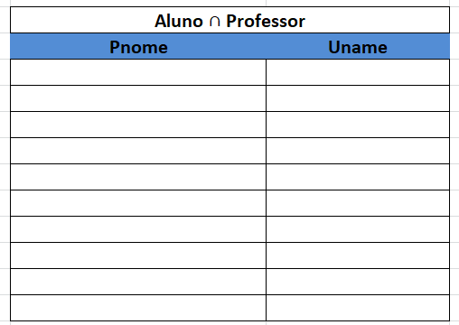

# Linguagens formais de consulta a bancos de dados

## Álgebra relacional e Cálculo relacional

### Instruções do projeto

De acordo com os conceitos estudados, exiba os resultados das consultas das operações select, project, união, intersecção e diferença. Siga as instruções com base na tabela apresentada em anexo.

- Mostre as informações apenas dos alunos aprovados. A aprovação é acima de 7,0;
- Exiba as informações dos alunos do primeiro ano com nota maior ou igual a 8,0;
- Exiba apenas os nomes e as notas dos alunos;
- Crie uma tabela PROFESSOR que apresente apenas o primeiro e o último nome do professor;
- Crie uma tabela ALUNO com o primeiro e o último nome de cada;
- Mostre o resultado da união entre a tabela ALUNO(PNome, UNome) e a tabela PROFESSOR;
- Exiba o resultado da intersecção entre a tabela ALUNO(PNome, UNome) e a tabela PROFESSOR;
- Exiba o resultado da diferença entre a tabela ALUNO(PNome, UNome) e a tabela PROFESSOR. 

- Mostre as informações apenas dos alunos aprovados. A aprovação é acima de 7,0;

π_(PNome) (σ_(Nota > 7.0) (ALUNO))

- Exiba as informações dos alunos do primeiro ano com nota maior ou igual a 8,0;

σ P.aluno ∧ serie = '1ºano' ∧  >= 8.0 (aluno) 

 

- Exiba apenas os nomes e as notas dos alunos;

σ P.aluno  ∧ notas (aluno)

- Crie uma tabela PROFESSOR que apresente apenas o primeiro e o último nome do professor;

- Crie uma tabela ALUNO com o primeiro e o último nome de cada;

- Mostre o resultado da união entre a tabela ALUNO(PNome, UNome) e a tabela PROFESSOR;

- Exiba o resultado da intersecção entre a tabela ALUNO(PNome, UNome) e a tabela PROFESSOR;

- Exiba o resultado da diferença entre a tabela ALUNO(PNome, UNome) e a tabela PROFESSOR. 

P.png)