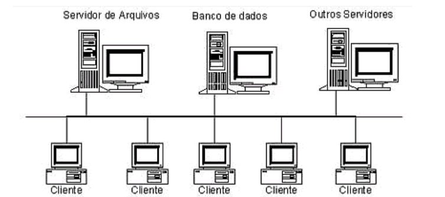

## Sistema gerenciamento de banco de dados

### Instruções do projeto

Pesquise uma ilustração que representa a arquitetura cliente-servidor e, com base na imagem, explique o seu funcionamento.

Conforme pode ser visto na figura, temos Servidores para Arquivos, Banco de dados e outras funções, tais como: Servidores de impressão, Servidores Web, etc. Estas redes, tipicamente, são formadas por Servidores, os quais são equipamentos com um maior poder de processamento e armazenamento do que os clientes, os quais, na maioria dos casos, são Microcomputadores ligados em rede.