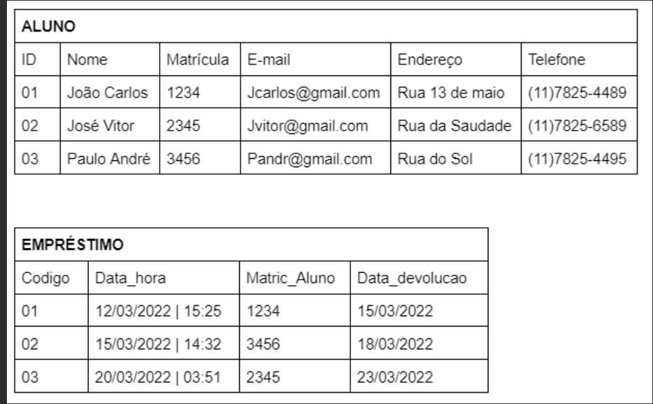
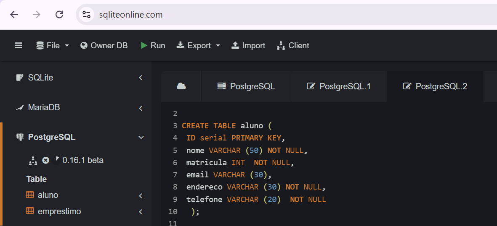
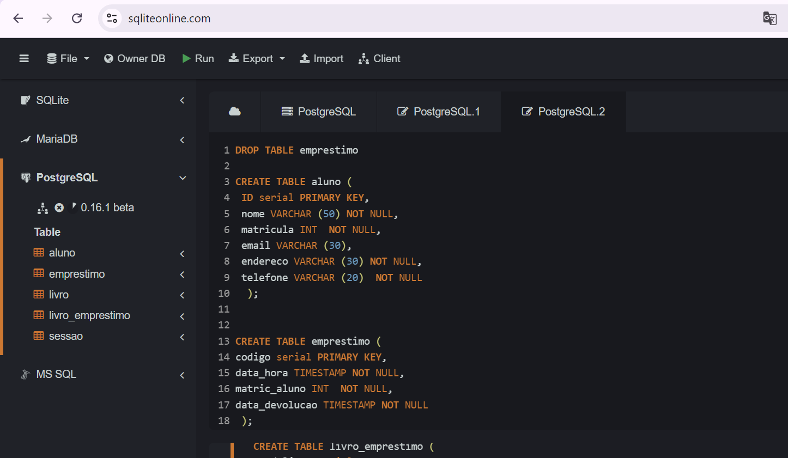

# Subconjunto da linguagem SQL

## Instruções do projeto

De acordo com os comandos aprendidos, programe códigos SQL para criar um banco de dados chamado ESCOLA e deixe-o pronto para o uso. Depois, pesquise qual é o comando utilizado para inserir uma tabela no banco de dados e siga as instruções:

1. crie uma tabela chamada ALUNO;  
2. defina os atributos da tabela;
3. adicione a chave primária de nome ID (identificador);
4. adicione um atributo nome do tipo varchar;
5. adicione um atributo e-mail do tipo varchar;
6. adicione um atributo endereço do tipo varchar.

Tabelas Criadas 

 , 

### Resultado

CREATE TABLE aluno (
 id serial PRIMARY KEY,
 nome VARCHAR (50) not NULL,
 matricula INT  NOT NULL,
 email VARCHAR (30),
 endereco VARCHAR (30) not NULL,
 telefone VARCHAR (20)  not NULL
  );

