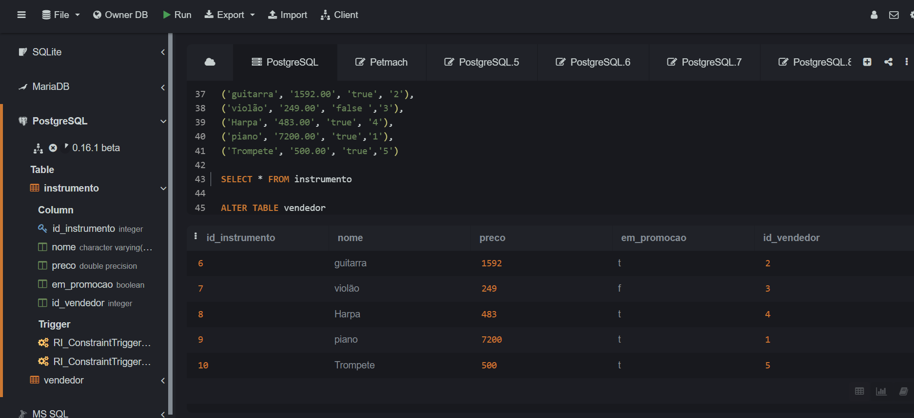
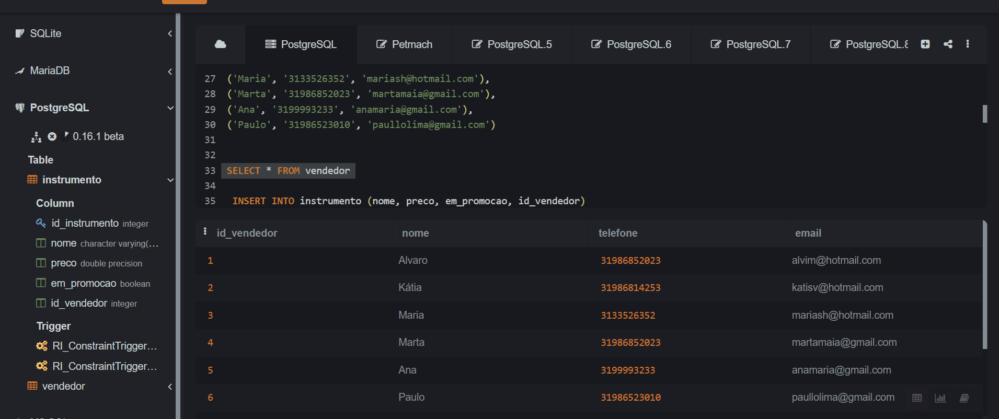
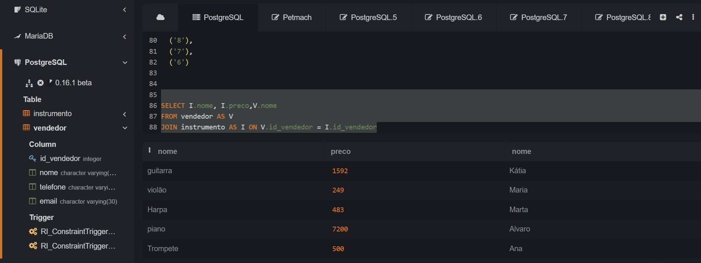
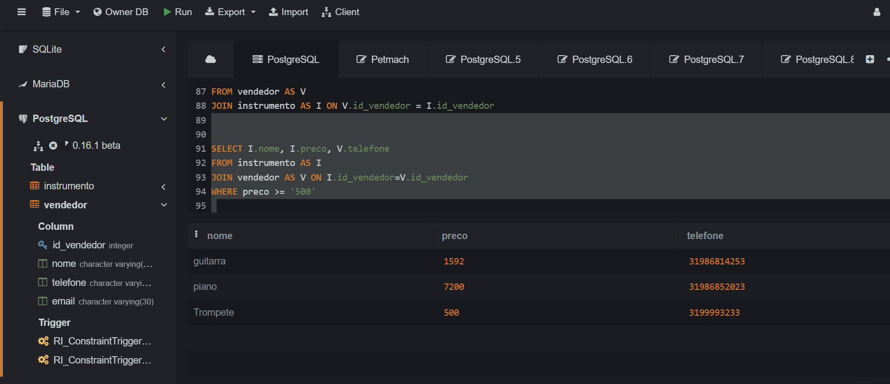

## Instruções do projeto


Desenvolva um banco de dados e relacione tabelas através de chaves estrangeiras ou nomes de colunas iguais. Siga as instruções:

crie uma base de dados; 
crie tabelas nessa base de dados;
em cada tabela, adicione atributos;
insira dados em cada tabela;
utilize os comandos Joins para realizar consultas nas tabelas. 

```sql

  CREATE TABLE instrumento(
  id_instrumento serial PRIMARY KEY,
  nome VARCHAR (50) not NULL,
  preco FLOAT NOT NULL,
  em_promocao BOOLEAN,
  id_vendedor INTEGER,
  FOREIGN KEY (id_vendedor) REFERENCES vendedor(id_vendedor)
);
 INSERT into instrumento (nome, preco, em_promocao, id_vendedor)
  VALUES
  ('guitarra', '1592.00', 'true', '2'),
  ('violão', '249.00', 'false ','3'),
  ('Harpa', '483.00', 'true', '4'),
  ('piano', '7200.00', 'true','1'),
  ('Trompete', '500.00', 'true','5')
  
 ```

 

 ```sql
  CREATE TABLE vendedor (
  id_vendedor serial PRIMARY KEY,
  nome VARCHAR (50) not NULL,
  telefone VARCHAR (20)  not NULL,
  email  VARCHAR (30) not NULL
  );

  INSERT into vendedor (nome, telefone, email)
 VALUES 
 ('Alvaro', '31986852023', 'alvim@hotmail.com'),
 ('Kátia', '31986814253', 'katisv@hotmail.com'),
 ('Maria', '3133526352', 'mariash@hotmail.com'),
 ('Marta', '31986852023', 'martamaia@gmail.com'),
 ('Ana', '3199993233', 'anamaria@gmail.com'),
 ('Paulo', '31986523010', 'paullolima@gmail.com')
  
 ```

 

  ### Consultas

  1 - Consultar nome e preço dos intrumentos e o nome dos fornecedores


 ```sql  
select I.nome, I.preco,V.nome
from vendedor as V
join instrumento AS I ON V.id_vendedor = I.id_vendedor

 ```

 

 2 - Consultar telefone vendedor, nome  e preço do instrumento com preço >= a 500 

  ```sql

SELECT I.nome, I.preco, V.telefone
FROM instrumento AS I
JOIN vendedor AS V ON I.id_vendedor=V.id_vendedor
WHERE preco >= '500'

  ```

  
 