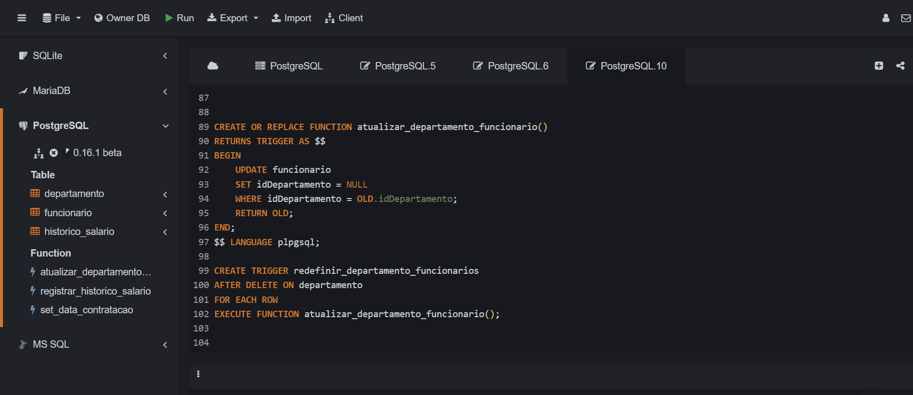

## Instruções do projeto


Crie um banco de dados, adicione tabelas e determine quais são os atributos de cada uma. Em seguida, execute um trigger que se relacione com algum comando, como insert, select, delete ou update.

 ```sql
    CREATE TABLE departamento (
    idDepartamento  serial PRIMARY KEY ,
    nome VARCHAR(100) NOT NULL,
    localizacao VARCHAR(100)
);

    INSERT INTO departamento (nome, localizacao)
    VALUES
   ('Recursos Humanos', 'São Paulo'),
   ('TI', 'Rio de Janeiro'),
   ('Financeiro', 'Curitiba');

```

  
    
```sql
    CREATE TABLE funcionario (
    idFuncionario serial PRIMARY KEY,
    nome VARCHAR(100) NOT NULL,
    cargo VARCHAR(50),
    salario DECIMAL(10, 2),
    dataContratacao DATE,
    idDepartamento INT,
    FOREIGN KEY (idDepartamento) REFERENCES departamento(idDepartamento)
);

  INSERT INTO funcionario (nome, cargo, salario, dataContratacao, idDepartamento)
  VALUES
  ('Ana Souza', 'Analista', 4500.00, '2022-06-15', 1),
  ('Carlos Lima', 'Desenvolvedor', 5500.00, '2021-02-20', 2),
  ('Maria Oliveira', 'Contadora', 6000.00, '2020-11-12', 3);


```

    


### Trigger para Armazenar Histórico de Salários
### Essa trigger salva o salário antigo de um funcionário em uma tabela historico_salario antes de uma atualização de salário.

```sql
          CREATE OR REPLACE FUNCTION registrar_historico_salario()
RETURNS TRIGGER AS $$
BEGIN
    IF OLD.salario IS DISTINCT FROM NEW.salario THEN
        INSERT INTO historico_salario (idFuncionario, salarioAntigo, dataAlteracao)
        VALUES (OLD.idFuncionario, OLD.salario, NOW());
    END IF;
    RETURN NEW;
END;
$$ LANGUAGE plpgsql;

CREATE TRIGGER salvar_historico_salario
BEFORE UPDATE ON funcionario
FOR EACH ROW
EXECUTE FUNCTION registrar_historico_salario();

  ```
*****************************************************************************
### Trigger para Definir a Data de Contratação na Inserção de Funcionários
### Essa trigger define automaticamente a data de contratação (dataContratacao) com a data atual no momento da inserção de um funcionário.

  ```sql
CREATE OR REPLACE FUNCTION set_data_contratacao()
RETURNS TRIGGER AS $$
BEGIN
    NEW.dataContratacao := NOW();
    RETURN NEW;
END;
$$ LANGUAGE plpgsql;

CREATE TRIGGER definir_data_contratacao
BEFORE INSERT ON funcionario
FOR EACH ROW
EXECUTE FUNCTION set_data_contratacao();
  ```
******************************************************************************

  
### Trigger para Atualizar o Departamento de Funcionários Excluídos
Essa trigger define o campo idDepartamento como NULL para todos os funcionários cujo departamento foi excluído.

  ```sql

CREATE OR REPLACE FUNCTION atualizar_departamento_funcionario()
RETURNS TRIGGER AS $$
BEGIN
    UPDATE funcionario
    SET idDepartamento = NULL
    WHERE idDepartamento = OLD.idDepartamento;
    RETURN OLD;
END;
$$ LANGUAGE plpgsql;

CREATE TRIGGER redefinir_departamento_funcionarios
AFTER DELETE ON departamento
FOR EACH ROW
EXECUTE FUNCTION atualizar_departamento_funcionario();

```
