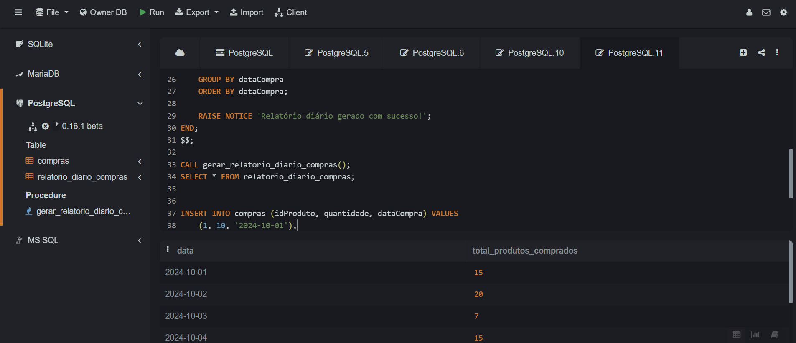

##  Instruções do projeto

Uma empresa de vendas tem um banco de dados com informações sobre os seus produtos.
 Ela precisa criar um relatório que faça um levantamento diário da quantidade de produtos 
 comprados por dia. Para ajudar a empresa, crie um procedure para agilizar esse processo.

´´´sql 

CREATE TABLE compras (
    idCompra SERIAL PRIMARY KEY,
    idProduto INT,
    quantidade INT,
    dataCompra DATE
);

´´´
´´´sql 
CREATE TABLE compras (
    idCompra SERIAL PRIMARY KEY,
    idProduto INT,
    quantidade INT,
    dataCompra DATE
);
´´´

´´´sql 

INSERT INTO compras (idProduto, quantidade, dataCompra) VALUES
    (1, 10, '2024-10-01'),
    (2, 5, '2024-10-01'),
    (3, 20, '2024-10-02'),
    (1, 7, '2024-10-03'),
    (4, 3, '2024-10-04'),
    (2, 12, '2024-10-04'),
    (3, 8, '2024-10-05'),
    (5, 15, '2024-10-05'),
    (1, 2, '2024-10-06'),
    (5, 11, '2024-10-06');

´´´
### Aqui está a procedure para calcular e inserir o total de produtos vendidos em cada data.

´´´sql 
CREATE OR REPLACE PROCEDURE gerar_relatorio_diario_compras()
LANGUAGE plpgsql
AS $$
BEGIN
    -- Limpa a tabela de relatório para evitar duplicações
    TRUNCATE TABLE relatorio_diario_compras;

    -- Insere o total de produtos comprados por dia no relatório diário
    INSERT INTO relatorio_diario_compras (data, total_produtos_comprados)
    SELECT dataCompra, SUM(quantidade)
    FROM compras
    GROUP BY dataCompra
    ORDER BY dataCompra;
    
    RAISE NOTICE 'Relatório diário gerado com sucesso!';
END;
$$;

CALL gerar_relatorio_diario_compras();
SELECT * FROM relatorio_diario_compras;

´´´

