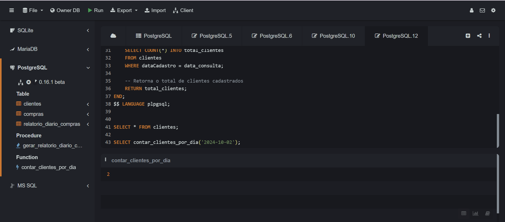

## Instruções do projeto

Uma loja tem um banco de dados que contém todo o controle de vendas de produtos e de cadastro de clientes. Pensando nisso, crie uma função para somar todos os clientes que foram cadastrados na loja durante um dia.

```sql

CREATE TABLE clientes (
    idCliente SERIAL PRIMARY KEY,
    nome VARCHAR(100),
    email VARCHAR(100),
    dataCadastro DATE
);

INSERT INTO clientes (nome, email, dataCadastro) VALUES
    ('João Silva', 'joao.silva@email.com', '2024-10-01'),
    ('Maria Oliveira', 'maria.oliveira@email.com', '2024-10-02'),
    ('Pedro Santos', 'pedro.santos@email.com', '2024-10-02'),
    ('Ana Costa', 'ana.costa@email.com', '2024-10-03'),
    ('Lucas Almeida', 'lucas.almeida@email.com', '2024-10-03'),
    ('Beatriz Souza', 'beatriz.souza@email.com', '2024-10-04'),
    ('Rafael Lima', 'rafael.lima@email.com', '2024-10-04'),
    ('Carolina Mendes', 'carolina.mendes@email.com', '2024-10-05'),
    ('Marcos Pereira', 'marcos.pereira@email.com', '2024-10-05'),
    ('Fernanda Duarte', 'fernanda.duarte@email.com', '2024-10-06');


CREATE OR REPLACE FUNCTION contar_clientes_por_dia(data_consulta DATE)
RETURNS INT AS $$
DECLARE
    total_clientes INT;
BEGIN
    -- Consulta a quantidade de clientes cadastrados na data informada
    SELECT COUNT(*) INTO total_clientes
    FROM clientes
    WHERE dataCadastro = data_consulta;
    
    -- Retorna o total de clientes cadastrados
    RETURN total_clientes;
END;
$$ LANGUAGE plpgsql;


SELECT * FROM clientes;

SELECT contar_clientes_por_dia('2024-10-02');


```

